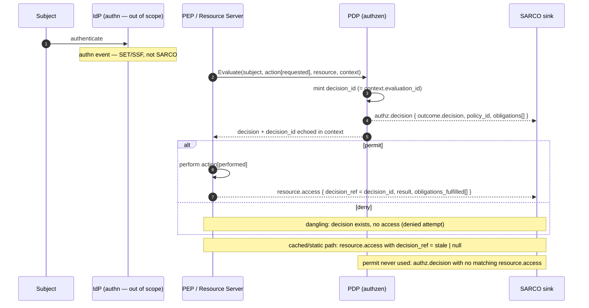

# RFC 0001: SARCO — an AuthZEN-aligned audit-log information model

- **Status:** Draft
- **Author:** Samuel Kelemen
- **Date:** [verify — set on publish]
- **Reviewers:** TBD

## Summary

SARCO is **S**ubject, **A**ction, **R**esource, **C**ontext, **O**utcome: a thin
audit-log information model that reuses the OpenID AuthZEN Authorization API 1.0
entities (`Subject`, `Action`, `Resource`, `Context`) verbatim and adds a
polymorphic **Outcome** plus a small correlation envelope.

It is **a profile, not a rival.** SARCO does not invent a competing audit
standard. It defines one SARC vocabulary — the same `Subject`/`Action`/`Resource`/`Context`
this repo already implements — across PDP decisions, resource-server access,
agent/MCP tool calls, access review, and `aarp` approvals, and it is specified so
it **round-trips losslessly** to the incumbent audit standards (OCSF, CADF, SET).
The win: one vocabulary for the whole suite, while keeping SIEM ingestion and
identity-event interop for free.

The load-bearing decision: **do not collapse the authorization decision log and
the resource-server access log into one record.** Unify the *vocabulary* (SARC);
separate the *events*. SARCO defines two event types over one schema —
`authz.decision` (what the PDP decided) and `resource.access` (what the resource
server actually did) — correlated by a PDP-minted `decision_id` plus trace
context.

## Problem & context

This repository implements the AuthZEN decision API (root package), an MCP
authorization profile (`mcp/`, "coaz"), an access-request/approval profile
(`accessrequest/`, `approval/`, "aarp"), and HTTP/gRPC bindings. What it does
**not** have is an audit story. The server, client, and `mcp.Enforcer` log only
errors — they never emit a record of the decision itself. A PDP that cannot say
*"alice was denied `mcp.tools.call` on `mcp_tool:transfer-funds` at T, under
policy P, for reason R"* cannot support access review, incident forensics, or
the just-in-time grant lifecycle that `aarp` is built to enable. This is the H4
production-readiness gap: **the system decides, but never records the decision.**

The deeper problem is a category error that most homegrown audit schemas make:
**a grant is not an action, and an authorization is not an access.** The PDP
authorizes; the resource server acts. These are different events, produced by
different emitters, at different times, holding different facts, and answering
different questions. Conflating them into a single "access log" record forces
the schema to lie about at least one of them.

Concretely, the granted ≠ performed distinction breaks a merged schema four ways:

1. **Cardinality is many-to-many.** One grant, token, or cached permit
   authorizes *N* subsequent actions; one attempted action may fan out to *N*
   sub-decisions (per field, per downstream). A single flat record cannot
   represent either fan-out without duplicating or dropping data.
2. **Different emitters hold different data at different times.** The PDP knows
   the policy id, the reason, and the obligations it issued. The resource server
   knows the effect, the status code, the latency, and *whether the obligations
   were actually fulfilled*. Neither party holds the other's facts at the moment
   it emits.
3. **Dangling events have nowhere else to live.** A denied attempt produces a
   decision but no access. A cached or static-rule access produces an access but
   no fresh decision. An allowed-but-never-exercised permit produces a decision
   with no matching access at all — the canonical over-permissioning signal. A
   merged record has no honest row for any of these.
4. **Different consumers ask different questions.** Policy-correctness and
   separation-of-duties review query *decisions* ("who was permitted what, under
   which policy"). Blast-radius and exfiltration forensics query *accesses*
   ("what was actually touched, and did it succeed"). Forcing both into one
   table makes both queries slower and more error-prone.

The killer detail is obligations. AuthZEN/XACML obligations are *issued on the
decision* (the PDP says "you may read this, but redact field X"). Whether they
were *fulfilled* is an execution fact known only at the resource server. A merged
record cannot represent "permit with obligation O, but O was not fulfilled" —
which is exactly the audit finding you most need to surface.

**What breaks if we do nothing:** `aarp` approvals and JIT/PAM grants remain
unauditable, the H4 gap stays open, and every consumer invents its own
incompatible log shape. **What breaks if we merge:** the schema silently drops
denied attempts, cached/static accesses, unexercised grants, and obligation
non-fulfillment — the highest-signal security events.

This work is motivated by the broader audit-logging workstream; SARCO is the
schema layer that makes the rest of that workstream queryable.

## Goals / Non-goals

**Goals**

- Define one SARC + Outcome vocabulary, reusing AuthZEN's `Subject`/`Action`/`Resource`/`Context`
  unchanged, usable across decisions, access, review, MCP tool logs, and `aarp`.
- Define two event types (`authz.decision`, `resource.access`) over that one
  schema, with a polymorphic Outcome.
- Specify the **correlation contract**: a PDP-minted `decision_id` and how a
  resource-access record references it.
- Guarantee lossless round-trip to OCSF, CADF, and SET so SIEM and identity-event
  pipelines work without translation loss.
- Make `aarp` approvals and JIT/PAM grant lifecycle events auditable.

**Non-goals**

- **Authentication events.** `authn` (login, MFA, session start) is adjacent but
  out of scope — that is SET/SSF/CAEP territory.
- **Replacing resource-server access logs.** RS teams MAY map existing access
  logs onto `resource.access`; SARCO does not mandate a rip-and-replace.
- **Mandating a transport.** SARCO is transport-agnostic, mirroring AuthZEN's own
  stance. SET is one binding, not a requirement.
- **Defining a tamper-evidence mechanism.** Integrity is an orthogonal layer
  (see Adjacent layers); SARCO does not bake a hash chain into the record.

## Proposal

### The SARC + Outcome model

A SARCO record is the four AuthZEN entities, plus an Outcome, plus an envelope.
The first four are reused **without modification** from the root `authzen`
package (`Subject` §5.1, `Action` §5.3, `Resource` §5.2, `Context` §5.4):

> OpenID AuthZEN Authorization API 1.0, §5 (Information model) —
> https://openid.net/specs/authorization-api-1_0.html

| Field | Source | Notes |
| --- | --- | --- |
| `subject` | `authzen.Subject` | Principal. `subject.id` SHOULD be expressible as an RFC 9493 subject identifier (see Mappings). |
| `action` | `authzen.Action` | **In `authz.decision` this is the *requested* action; in `resource.access` it is the *performed* action.** |
| `resource` | `authzen.Resource` | Target. |
| `context` | `authzen.Context` | Environment/request attributes (time, IP, trace). |
| `outcome` | **new (polymorphic)** | Shape depends on event type (below). |

The envelope carries identity and correlation:

| Field | Type | Notes |
| --- | --- | --- |
| `event_type` | string | `authz.decision` or `resource.access`. |
| `event_id` | string | Unique id of *this* record. |
| `decision_id` | string | **Decision-record only.** PDP-minted, stable id of the decision. |
| `decision_ref` | string \| null | **Access-record only.** References a `decision_id`; MAY be null (static rule) or stale (cached decision). |
| `occurred_at` | RFC 3339 | When the event happened. |
| `trace` | object | W3C trace context for cross-event correlation. |

The `decision_id`/`decision_ref` pair is the spine. It aligns with the
decision-context member this repo already defines: `context.evaluation_id`
(`accessrequest.MemberEvaluationID`) and `context.evaluated_at`
(`accessrequest.MemberEvaluatedAt`). A PDP that mints `context.evaluation_id`
SHOULD use the same value as `decision_id`, so the audit correlation key is the
same identifier already threaded through denial-binding and re-evaluation.

### Event type 1 — `authz.decision`

Emitted by the PDP (or the PEP that called it). The `action` is the **requested**
action. This is the home for decision-only events, including **denied attempts**.

```json
{
  "event_type": "authz.decision",
  "event_id": "evt_01HF...",
  "decision_id": "dec_01HF8Z9Q...",
  "occurred_at": "2026-01-12T19:20:30Z",
  "subject": { "type": "user", "id": "alice@example.com" },
  "action":   { "name": "mcp.tools.call" },
  "resource": { "type": "mcp_tool", "id": "transfer-funds",
                "properties": { "server_uri": "https://mcp.example.com" } },
  "context":  { "time": "2026-01-12T19:20:30Z", "ip_address": "172.217.22.14" },
  "outcome": {
    "decision": "deny",
    "policy_id": "policy.payments.v7",
    "reason": { "code": "missing_approval",
                "reason_admin": { "403": "no active grant for transfer-funds" } },
    "obligations": []
  }
}
```

Outcome (decision):

| Field | Type | Notes |
| --- | --- | --- |
| `decision` | `permit` \| `deny` | Maps to AuthZEN `decision: true/false` (§5.5). |
| `policy_id` | string | Policy that produced the decision. |
| `reason` | object | Reuses AuthZEN `reason_admin`/`reason_user` (`authzen.Reasons`). |
| `obligations` | array | Obligations *issued* (advice the PEP MUST honor). |

A permit-with-obligations decision records the obligations it *issued*. Whether
they were *fulfilled* is recorded on the matching `resource.access` event — never
here.

### Event type 2 — `resource.access`

Emitted by the resource server / PEP **after attempting** the action. The
`action` is the **performed** action. Carries `decision_ref` back to the
authorizing decision.

```json
{
  "event_type": "resource.access",
  "event_id": "evt_01HG...",
  "decision_ref": "dec_01HF8Z9Q...",
  "occurred_at": "2026-01-12T19:20:31Z",
  "subject": { "type": "user", "id": "alice@example.com" },
  "action":   { "name": "mcp.tools.call" },
  "resource": { "type": "mcp_tool", "id": "transfer-funds" },
  "context":  { "time": "2026-01-12T19:20:31Z", "latency_ms": 42 },
  "outcome": {
    "result": "failure",
    "status": 500,
    "effect": "no-op",
    "obligations_fulfilled": ["redact:account_number"]
  }
}
```

Outcome (access):

| Field | Type | Notes |
| --- | --- | --- |
| `result` | `success` \| `failure` \| `error` | What happened when the action ran. |
| `status` | integer | Transport/application status (e.g. HTTP/JSON-RPC). |
| `effect` | string | Side effect actually applied (`created`, `no-op`, ...). |
| `obligations_fulfilled` | array | Which issued obligations were actually honored. |

`decision_ref` MAY be:

- a valid `decision_id` (the normal case),
- **null** — access governed by a static rule with no PDP round trip, or
- **stale** — a cached permit reused past the decision instant.

### Asymmetric cases the split makes visible (and a merged schema hides)

- **Permit-then-failed:** `authz.decision` permit, `resource.access`
  `result: failure`. The grant was correct; the action broke. (Above example.)
- **Deny-then-attempted:** `authz.decision` deny, *no* `resource.access` — or, if
  a misbehaving PEP proceeds anyway, a `resource.access` whose `decision_ref`
  points at a *deny*. Both are first-class, queryable findings.
- **Authorized-but-unexercised:** `authz.decision` permit with no matching
  `resource.access` within the grant window — the over-permissioning signal.
- **Obligation non-fulfillment:** `authz.decision` issues obligation O;
  `resource.access` omits O from `obligations_fulfilled`. Invisible to any merged
  record.

### Flow



### Scope of this RFC's normative surface

SARCO **normatively defines `authz.decision`** as the core event — it is closest
to AuthZEN and is where this repository lives — **and specifies the correlation
contract** (`decision_id` semantics and propagation) that any `resource.access`
log MUST honor. `resource.access` is defined as a profiled **companion** event
type; resource-server teams MAY map their existing access logs onto it rather
than replace them. (The alternative — SARCO normatively owning both event types
in full — is in Open Questions.)

## Mappings

Round-tripping to the incumbents is what makes SARCO a profile rather than a
fork. Each mapping below is lossless in the direction that matters (SARCO →
incumbent for emission; incumbent → SARCO for ingestion of the fields SARCO
defines).

### OCSF — SIEM ingestion target (lead mapping)

Open Cybersecurity Schema Framework. SARCO is structured so a SIEM can ingest it
as native OCSF.

- `authz.decision` → **Identity & Access Management** category (UID 3), closest
  class **Authorize Session** (UID 3003). `outcome.decision` → activity/disposition;
  `subject`/`resource`/`action` → OCSF `actor`/`resource`/`api`/`activity`.
- `resource.access` → **Application Activity** category (UID 6), **API Activity**
  class (UID 6003). `outcome.result`/`status` → OCSF status/status_code.
- Schema: https://schema.ocsf.io/ (IAM category:
  https://schema.ocsf.io/categories/iam ; API Activity:
  https://schema.ocsf.io/classes/api_activity)

> Exact OCSF class/attribute pinning is version-sensitive (current line 1.x).
> Pin to a specific OCSF version in the profile doc. [verify — confirm the
> authoritative class for an authorization *decision* vs. session authorization
> on the target OCSF version]

### CADF (DMTF DSP0262)

Cloud Auditing Data Federation — Data Format and Interface Definitions
Specification, v1.0.0. The CADF event model maps onto SARC almost field-for-field:

| CADF | SARCO |
| --- | --- |
| `initiator` | `subject` |
| `action` | `action` |
| `target` | `resource` |
| `outcome` | `outcome.decision` / `outcome.result` |
| `observer` | the emitting PDP (`authz.decision`) or RS (`resource.access`) |
| `reason` | `outcome.reason` |

> DMTF DSP0262 (CADF), v1.0.0 —
> https://www.dmtf.org/sites/default/files/standards/documents/DSP0262_1.0.0.pdf
> (index: https://www.dmtf.org/dsp/DSP0262)

### SET / SSF / CAEP — transport & distribution

- **Transport:** SARCO records MAY be emitted as Security Event Tokens.
  > RFC 8417 — Security Event Token (SET) —
  > https://datatracker.ietf.org/doc/html/rfc8417
- **Subject identity:** SARCO's `subject` SHOULD be expressible as an RFC 9493
  subject identifier so SET emission is lossless (no identity flattening).
  > RFC 9493 — Subject Identifiers for Security Event Tokens —
  > https://datatracker.ietf.org/doc/html/rfc9493
- **Streaming binding:** SSF/CAEP is the natural streaming distribution layer.
  JIT-grant issue/expire/revoke events from `aarp` (`approval.Grant`,
  `StatusApproved`/`StatusExpired`/`StatusCanceled`) are natural CAEP signals.
  > OpenID Shared Signals Framework 1.0 —
  > https://openid.net/specs/openid-sharedsignals-framework-1_0-final.html
  > OpenID Continuous Access Evaluation Profile 1.0 —
  > https://openid.net/specs/openid-caep-1_0-final.html

## Adjacent layers (scope boundaries)

These are explicitly **not** part of the SARCO record; they sit above or below it.

- **Tamper-evidence (below):** integrity is orthogonal to the schema. Use a
  Merkle-tree transparency log as the integrity layer; do not embed a hash chain
  in the record.
  > RFC 6962 — Certificate Transparency —
  > https://datatracker.ietf.org/doc/html/rfc6962 ;
  > RFC 9162 — Certificate Transparency Version 2.0 —
  > https://datatracker.ietf.org/doc/html/rfc9162 .
  > Implementations: Trillian, Sigstore/Rekor.
- **Retention / review / accountability (above):** *what* must be logged and
  retained is governance, not a wire format.
  > NIST SP 800-92 — Guide to Computer Security Log Management —
  > https://csrc.nist.gov/pubs/sp/800/92/final ;
  > NIST SP 800-53 Rev. 5, the Audit and Accountability (AU) control family —
  > https://csrc.nist.gov/pubs/sp/800/53/r5/upd1/final .

## Alternatives considered

Each option gets its best case before the concrete reason it loses here.

1. **Adopt OCSF as-is.** *Best case:* it is the de facto SIEM schema, broad and
   well-maintained; emitting native OCSF means zero ingestion translation. *Why
   it loses:* OCSF is a security-event *taxonomy*, not an AuthZEN-aligned model.
   Its `Subject`/`Action`/`Resource` do not line up with the AuthZEN entities this
   suite is built on, so adopting it wholesale means re-modeling every decision
   into OCSF's shapes and losing the one-vocabulary win across `coaz`/`aarp`.
   SARCO keeps the AuthZEN entities and *maps to* OCSF — we get ingestion without
   surrendering the model.
2. **Adopt CADF as-is.** *Best case:* its initiator/action/target/outcome/observer
   model is almost exactly SARC, and it is a published DMTF standard. *Why it
   loses:* CADF is comparatively dormant, cloud-audit-centric, and not where SIEM
   ingestion or identity-event streaming lives today; betting the suite's audit
   model on it trades momentum for a clean field mapping we can get anyway by
   *mapping to* CADF rather than adopting it.
3. **Extend SET/SSF only.** *Best case:* SET is a real IETF transport with an
   existing identity-event ecosystem (CAEP), and RFC 9493 gives clean subject
   identifiers; we would inherit distribution for free. *Why it loses:* SET is a
   *transport/envelope*, not an information model — it tells you how to carry an
   event, not how to shape a decision-vs-access record. Building only on SET
   leaves the actual schema undefined, which is the entire problem. SARCO uses
   SET as one binding (above) instead of as the model.
4. **Single merged decision+access record.** *Best case:* one event type is
   simpler to emit, simpler to query for the naive "what happened" question, and
   avoids a correlation contract entirely. *Why it loses:* it is forced to lie.
   The many-to-many cardinality, the split between PDP-held and RS-held facts,
   the dangling events (denied attempt, cached/static access, unexercised
   permit), and obligation non-fulfillment all become unrepresentable or
   duplicated. The simplest schema hides exactly the highest-signal events.
5. **Status quo / do nothing.** *Best case:* no new surface to build or socialize;
   the suite already ships a working decision API. *Why it loses:* the H4 gap
   stays open — the system decides but never records — so `aarp` approvals and
   JIT/PAM grants are unauditable, and every consumer invents an incompatible log
   shape. The thing the security workstream most needs to produce (evidence of
   who was permitted/denied what, and what they then did) is the thing this
   option cannot produce.

## Assumptions & risks

Load-bearing assumptions first; failure modes are written so a reviewer can check
them, ordered by impact × likelihood.

- **Assumption: SARCO round-trips to OCSF's authorization/IAM and API-activity
  classes.** If true, SIEM ingestion is free. *Fails if* the target OCSF version
  has no class that cleanly carries an authorization *decision* (permit/deny +
  policy + reason + issued obligations) without lossy coercion. *Cheapest test:*
  map the two JSON examples above into a pinned OCSF version and diff for dropped
  fields before committing the mapping.
- **Assumption: every `subject` can be expressed as an RFC 9493 subject
  identifier.** *Fails if* a subject (e.g. an MCP `agent` with only an actor
  claim, per `mcp.SubjectFromToken`) has no representable RFC 9493 identifier, so
  SET emission flattens or drops identity. *Mitigation/test:* enumerate the
  `mcp` subject types (`user`/`client`/`agent`) against RFC 9493 identifier
  formats; define a fallback identifier format for the gap.
- **Assumption: PEPs can propagate `decision_id` through cached and static
  paths.** *Fails if* a PEP enforcing a cached or static-rule decision cannot
  carry a `decision_ref` (null or stale), breaking correlation precisely on the
  paths the split is meant to expose. *Mitigation/test:* prototype the
  correlation echo on the `mcp.Enforcer` cached path before mandating it.
- **Risk: the two-event model is more to socialize than a single record.** *Fails
  if* downstream teams ship a merged record anyway because the correlation
  contract feels heavy. *Mitigation:* ship `authz.decision` + the contract first
  (Rollout phase 1); make `resource.access` an opt-in companion.
- **Risk: obligation vocabularies diverge.** *Fails if* `obligations` (issued) and
  `obligations_fulfilled` use incompatible identifiers, so non-fulfillment can't
  be computed by set difference. *Mitigation:* require a shared obligation id
  space across decision and access; *test:* a conformance vector asserting
  `issued − fulfilled` is computable.

## Rollout / migration

Phased, internal-first, with an explicit path to externalize.

1. **Phase 1 — internal profile + H4 hook.** Define SARCO as an in-repo profile
   (this RFC → a `sarco/` package mirroring how `mcp/`, `accessrequest/`,
   `approval/` are structured). Add the missing audit hook on the
   server/client/`mcp.Enforcer` decision path so it **emits `authz.decision`**.
   Ship the `decision_id` ↔ `context.evaluation_id` correlation contract. This
   alone closes H4.
2. **Phase 2 — companion access events + OCSF export.** Add `resource.access` as a
   companion type, with a reference exporter to a pinned OCSF version for SIEM
   ingestion. Wire `aarp` grant lifecycle (issue/expire/revoke) as CAEP signals.
   Resource-server teams map existing access logs onto `resource.access` (no
   rip-and-replace).
3. **Phase 3 — externalize.** With the profile proven internally, sketch
   externalization as an OpenID AuthZEN profile and/or an IETF Internet-Draft —
   "perhaps later we standardize it." Reuse the OpenID profile conventions the
   `accessrequest` package already follows (the `urn:openid:authzen:...`
   capability namespace).

## Open questions

Cheap, decisive questions first.

1. **Does SARCO normatively own both event types, or just `authz.decision` + the
   correlation contract?** This RFC recommends the latter (tighter, more
   shippable, and where the repo lives); the former is more complete but a bigger
   thing to socialize. *Decide first — it scopes everything below.*
2. **Which exact OCSF version and class do we pin `authz.decision` to** —
   Authorize Session (UID 3003) under IAM, or a dedicated authorization class on
   a newer OCSF line? (Cheap to test by mapping the two examples; see Risks.)
3. **Is `decision_id` always equal to `context.evaluation_id`, or a superset?**
   (Equal is simplest and reuses existing denial-binding plumbing.)
4. **Do we mandate a single obligation id space across `obligations` and
   `obligations_fulfilled`** so non-fulfillment is a set difference?
5. **Where do `aarp` JIT-grant lifecycle events sit** — modeled as `authz.decision`
   variants, as CAEP signals, or both?
